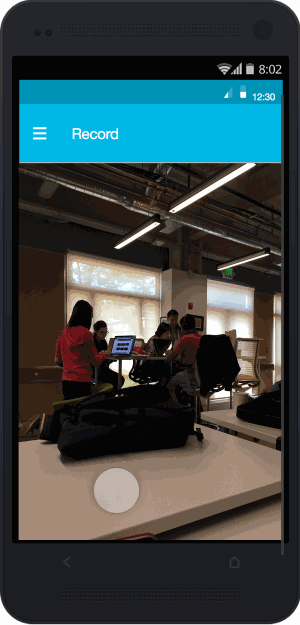

# SaferRoads
Learn more at [saferroads.bike](http://saferroads.bike)

SaferRoads was developed as part of the [May 2015 AT&T Mobile Hackathon](http://www.eventbrite.com/e/att-mobile-app-hackathon-bay-area-tickets-15621101134) in Palo Alto.

## Problem Statement
Cities all over are building these awesome bike lanes. They make riding a lot safer: unless there's someone illegally parked in the bike lane.

SaferRoads is an Android app that makes it easier for cyclists to report dangerously parked official vehicles, like delivery trucks, to the company that operates them.
Solution
SaferRoads is an Android app that you run while you ride your bike. It provides a low friction way to note incidents of unsafe driving, and a one interface for reporting those incidents to the relevant corporate safe driver program. 

## Usage

0. Before you get on your bike, equip your Myo armband and start the SaferRoads app.
0. Mount your Android device to your bike so its camera can see the road.
0. When a driver does something dangerous, act as you normally would. Emergency stop, swerve, or whatever you need to do. Stay safe. 
0. Once you've recovered, and in a safe situation, signal the app by spreading your fingers. This tells SaferRoads to note an incident. The incident report contains the previous 60 seconds of video along with the time and location of the incident.
0. Close the SaferRoads app once you have arrived at your destination.
0. Later, when you have a free moment, open SaferRoads. Navigate to the incident log, and report each incident to the appropriate company. The app will submit the report to the company's preferred reporting form or email address.

## Technology Used
- Android (duh)
- [Myo armband](https://www.thalmic.com/en/myo/)
- [YouTube Data APIs v3](https://developers.google.com/youtube/v3/)

## Next Gen interface
We only had time to implement an engineering interface during the hackathon, but we have this wonderful design that we plan to implement in the next revision:

